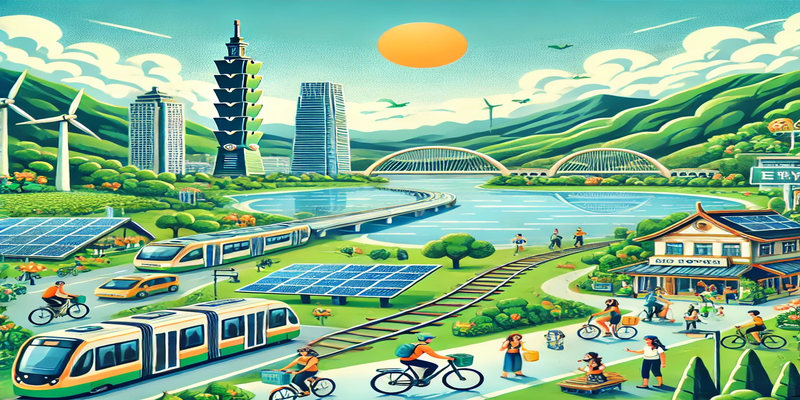

# 旅遊減碳
## 1. 旅遊與碳排放：現況與影響


**介紹全球旅遊業對碳排放的影響，數據與現況分析。**
- 全球旅遊業的*碳排放比例*
- **交通運輸**的碳足跡
- ***住宿與旅遊***活動的碳排放
- 旅遊業的碳排放<ins>成長趨勢</ins>
- <sub>低碳旅遊</sub>的現況與<sup>挑戰</sup>
## 2. 低碳旅遊的關鍵策略
```
碳排放（kg CO₂）= 旅程距離（km） × 排放係數（kg CO₂/km）
飛機：0.1 ~ 0.25 kg CO₂/km（依機型與航程長短而定）
高鐵：0.03 ~ 0.05 kg CO₂/km
汽車（燃油）：0.12 ~ 0.25 kg CO₂/km（依車型與載客數）
電動車：0.02 ~ 0.07 kg CO₂/km（依電力來源）
```
探討如何降低旅遊碳足跡，包括交通、住宿、餐飲等方面的策略。
## 3. 綠色交通與住宿選擇
選擇綠色交通與住宿是實踐低碳旅遊的關鍵。優先搭乘`高鐵`、`電動車`、`公共運輸`或`自行車`等低碳交通工具，以減少碳排放。在住宿方面，可選擇獲得環保認證的飯店，如 LEED 或 EarthCheck 認證，或支持當地民宿以降低環境影響。透過這些選擇，旅客能夠在享受旅行的同時，減少對環境的負擔，實現更永續的旅遊方式。
## 4. 實踐永續旅行：個人與企業的角色
個人如何改變旅遊習慣?\
企業如何推動永續旅遊？\
案例分享。  
## 5. 未來趨勢與行動指南
低碳旅遊的未來發展，政府政策、科技創新，並提供具體可行的行動建議。
